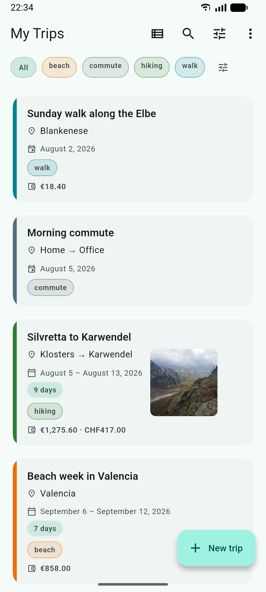
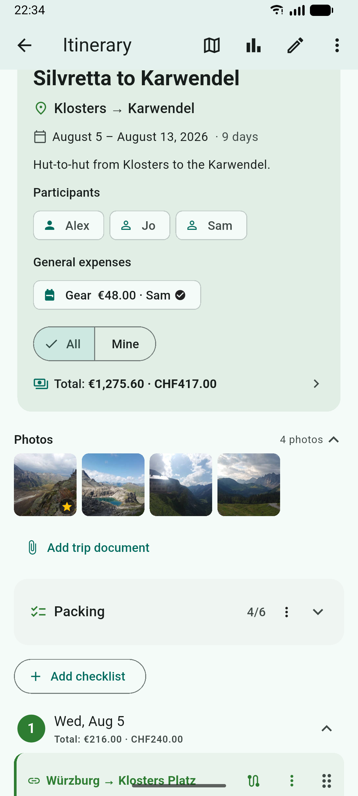
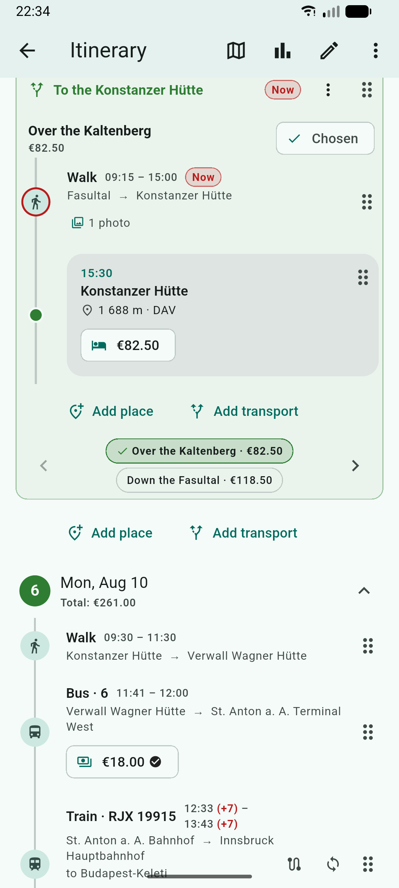
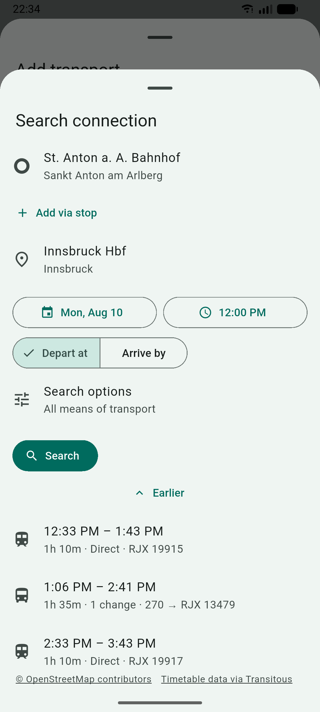
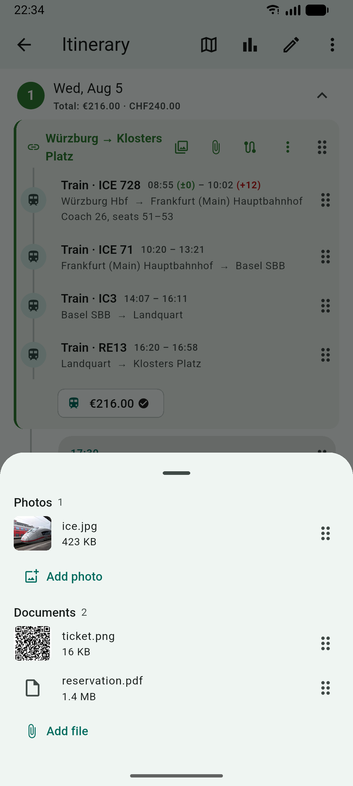
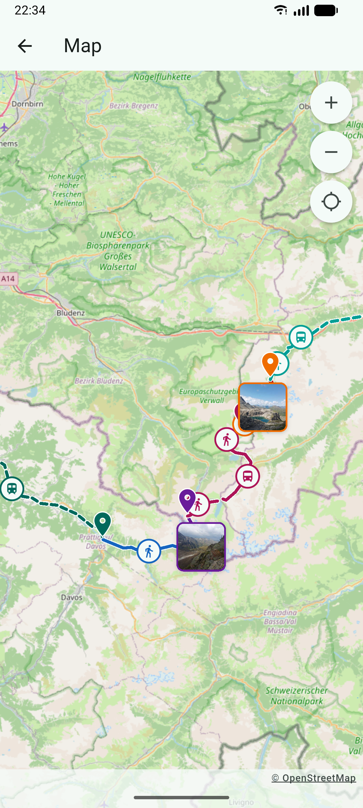
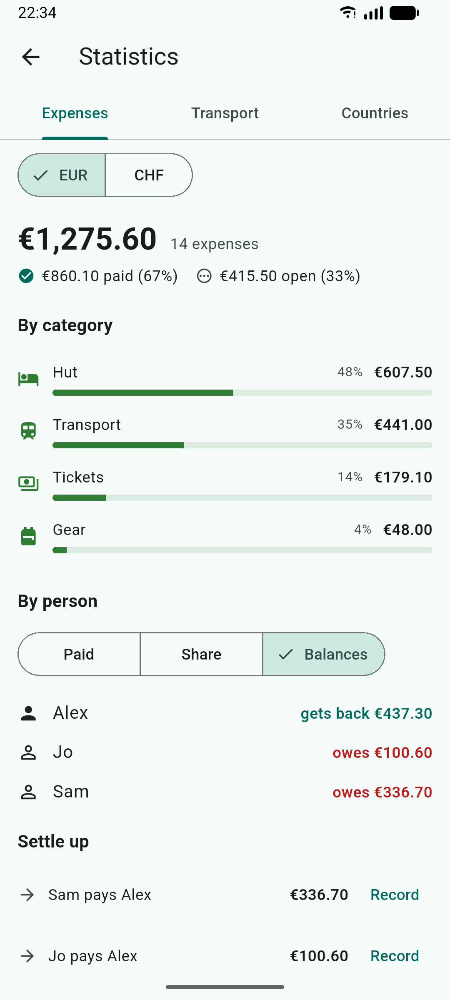
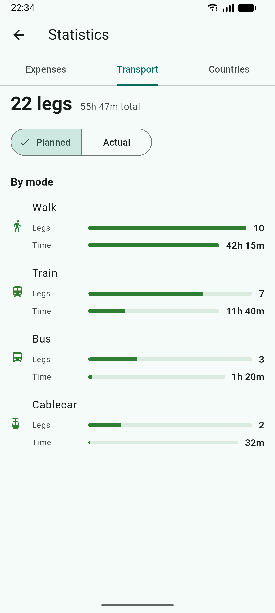
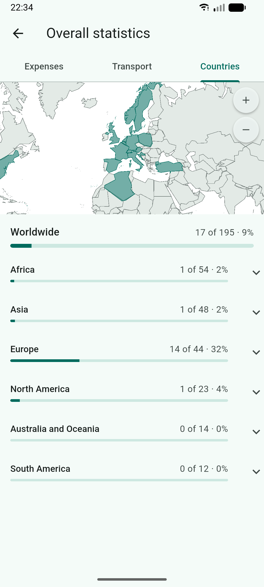

<p align="center">
  
</p>

# Pappus Travel Planner

[](https://flutter.dev)
[](https://dart.dev)
[](https://www.gnu.org/licenses/gpl-3.0)
[](https://github.com/Calyptra-Software/PappusTravelPlanner/actions/workflows/ci.yml)
[](https://codecov.io/gh/Calyptra-Software/PappusTravelPlanner)

Plan a trip day by day — where you go, how you get there, and what it costs, broken down by
category and by person — and keep the whole database in **one portable SQLite file that belongs to
you**. No account, no server, nothing uploaded. The app works with the network switched
off; the exceptions are an optional connection search that looks up real timetables and
writes the answer into your local plan, and the map, whose background tiles are fetched
while you look at them.

You can plan all kinds of trips: an afternoon out, the daily commute, and two weeks abroad
are planned the same way, and differ only in their dates. The primary target is
**Android**, but the same code base runs on Web, Linux, Windows, macOS, and iOS.

## Screenshots

|  |  |  |
|:--:|:--:|:--:|
|  |  |  |
| **Every trip in one list** — your own tags and colors, and a total per currency | **A trip and all that hangs off it** — who is coming, what it costs, the photos, what to pack | **The day itself** — where you are right now, and two ways the afternoon could go |
|  |  |  |
| **Real departures** from an open timetable, ready to drop straight into the day | **Tickets where the journey is** — photos and files on a leg, a whole run, or the trip | **The route on the map** — underlying GPX data and color of your choice |
|  |  |  |
| **Where the money went** — by category, by person, and the shortest way to settle up | **How you actually traveled** — legs and time per mode, planned against recorded | **Where you've been** — countries your trips touched, plus the ones you tick yourself |

## Get the app

Android builds are on the
[Releases page](https://github.com/Calyptra-Software/PappusTravelPlanner/releases). Take the
APK matching your device's architecture — `arm64-v8a` for essentially any phone of the last
decade — and allow your file manager to install it, since it does not come from a store.
There is no store listing yet.

Every other platform, and Android if you would rather not run a stranger's binary, is a
[build from source](#build-from-source) away.

## Features

- **Trips, organized the way you file them** — dates, notes, participants, an accent color,
  and tags you invent yourself. Search, filter, and sort the overview, or switch it to a
  month calendar.
- **Routines** — keep a commute or a weekly ride as a dateless template and stamp it out
  onto any day, before or after the fact.
- **A day-by-day itinerary** of places and transport legs, with optional times, grouping for
  a shared ticket, and drag-to-reorder.
- **Alternatives** — plan different ways a day could go and pick one later; only the chosen
  option counts toward the trip's money.
- **Planned versus actual times**, with a green or red `+/−` on each end, and a "you are
  here" mark on today's plan.
- **Real connections** — search an open routing service (Transitous) covering public transport,
  long-distance trains, buses, and more from operators around the world, compare the results,
  import one as that day's legs, and refresh its live times later.
- **A map** — a trip's places and legs on an OpenStreetMap background, with the entry that
  is under way marked as the timeline marks it. Import a **GPX** track onto a leg and the
  map draws the line you actually followed instead of the straight one.
- **Photos and files on the plan** — attach a photograph or a document to an entry, to a
  group, or to the trip itself. They live inside the database, so a copy of that one file
  is a copy of everything. A photo carrying a position shows up on the map, and one of them
  can be the cover on the trip's overview card.
- **Costs in as many currencies as you like** — attached to a place, a leg, a whole shared
  ticket, or the trip, with your own categories and your own exchange rates.
- **Countries you have been to** — the world drawn from bundled outlines, counted from
  your trips or entered manually.
- **Statistics** — spending by category and by person, and how you actually traveled:
  legs and time per transport mode, planned against what really happened.
- **Settle-up** — paid versus fair share, a minimal set of payments to square up, and
  settlements you can book back once they are paid.
- **Checklists** per trip, movable and copyable to the next one.
- **Share and export** — a lossless `.tpt` bundle for another user of the app (attachments
  included), a printable PDF with the sections you tick, or an `.ics` file for whatever
  calendar you already use.
- **An Android home-screen widget** — your current or next trip, a countdown, and today's
  plan with the same delay marks the timeline uses; tapping a row opens that entry.
- **English and German**, and a light / dark / system theme.

**[The long version, with the reasoning behind each of these, is in
`docs/features.md`.](docs/features.md)** What changed per release is in
[CHANGELOG.md](CHANGELOG.md).

## Your data

Everything lives in a single SQLite file — a standard database, not a proprietary
container, so you can copy it between devices and platforms and open it with any tool that
reads SQLite. Under **Settings → Database**:

- **Desktop:** *Open* an existing `.sqlite` file or create a *New* one at any path; the
  choice is remembered across launches, and *Reset to default* points the app back at its
  own file.
- **Android / Web:** *Import* a `.sqlite` file (replacing the current data) or *Export* the
  current database. On web the data lives in browser storage (OPFS, falling back to
  IndexedDB).

To move **one trip** rather than the whole database, use the share button on the trip
screen: it writes a `.tpt` bundle the recipient imports from the trips overview. On Android
a `.tpt` file shared to — or opened with — Pappus goes straight into the import flow. The
same button offers **Export as PDF** and **Export to calendar**; both are one-way views of
the plan, and only the `.tpt` bundle can be imported back.

## Data sources and the routing service

The connection search talks to [Transitous](https://transitous.org), a community-run,
donated MOTIS instance serving [public-transport open data](https://transitous.org/sources/)
on top of [OpenStreetMap](https://www.openstreetmap.org/copyright).

The map draws [OpenStreetMap](https://www.openstreetmap.org/copyright) tiles from the
OpenStreetMap Foundation's own servers. Their
[tile usage policy](https://operations.osmfoundation.org/policies/tiles/) permits ordinary
interactive viewing and forbids downloading areas in advance.

Both policies are functional requirements of this app — see the
*routing service* section of [CONTRIBUTING.md](CONTRIBUTING.md) before touching anything
that makes requests.

## Build from source

You need the **Flutter SDK, stable channel, 3.47 or newer** on your `PATH` (check with
`flutter doctor`), plus a target to run on — an Android device or emulator, Chrome, or a
desktop OS. Android builds additionally need the Android SDK, most easily via Android
Studio.

```bash
flutter pub get
dart run build_runner build --delete-conflicting-outputs   # Drift + Riverpod
flutter gen-l10n                                           # localizations
flutter run -d linux                                       # or android, chrome, windows, macos
```

Both generators also run as part of `flutter run` / `flutter build`, so the explicit calls
are only needed after editing a Drift table, a `@riverpod` provider, or an ARB file. List
what you can run on with `flutter devices`; `flutter emulators --launch <id>` starts an
Android emulator first.

`flutter build` produces a release build by default; add `--debug` for a debug one.

| Platform | Command | Output |
|---|---|---|
| Android (APK) | `flutter build apk` | `build/app/outputs/flutter-apk/app-release.apk` |
| Android (Play) | `flutter build appbundle` | `build/app/outputs/bundle/release/app-release.aab` |
| Web | `flutter build web` | `build/web/` |
| Linux | `flutter build linux` | `build/linux/x64/release/bundle/pappus` |
| Windows | `flutter build windows` | `build/windows/x64/runner/Release/` |
| macOS | `flutter build macos` | `build/macos/Build/Products/Release/` |
| iOS | `flutter build ios` | open `Runner.xcworkspace` in Xcode to sign and deploy |

> **Tip:** a debug APK bundles every CPU architecture and is large. For a quick emulator
> install, build a single architecture: `flutter build apk --release --target-platform
> android-x64`, then `adb install …`.

The web build needs two prebuilt assets in `web/`, regenerated whenever `drift` or
`sqlite3` are upgraded — `sqlite3.wasm` and `drift_worker.js`; the *Web* section of
[AGENTS.md](AGENTS.md) says where they come from.

## Project structure

```text
lib/
  main.dart                 # entry point (ProviderScope + startup wiring)
  app.dart                  # MaterialApp.router, theme, localization
  core/                     # theme, router, providers, settings, formatting helpers
  data/
    database/               # Drift tables, database, DAOs (trips, itinerary, costs, checklists)
    repositories/           # thin repository over the DAOs
  features/
    trips/                  # overview, calendar, create/edit, detail, participants, tags, routines
    itinerary/              # timeline, day blocks, alternatives, item form, now marker, modes
    transport_search/       # online connection search (Transitous/MOTIS) + live-times refresh
    map/                    # trip map: pure feature building + the basemap and its screen
    attachments/            # photos and files on an entry, a group, or the trip; gallery
    costs/                  # cost form, splitting/stats, settlements, reasons, currencies
    checklist/              # per-trip named checklists
    sharing/                # portable trip bundles (.tpt), plus PDF and .ics export
    settings/               # language, theme, categories, currencies, modes, people, database
    home_widget/            # Android widget payload + sync
  l10n/                     # app_en.arb, app_de.arb + generated classes
android/ ios/ linux/ ...    # per-platform host projects
web/                        # web host page + prebuilt sqlite3.wasm / drift_worker.js
tool/                       # dev-only scripts (e.g. a live smoke test for the routing client)
test/                       # unit and widget tests
integration_test/           # flows driven against the real widgets and a real database
```

State lives in [Riverpod](https://riverpod.dev) providers, navigation in
[go_router](https://pub.dev/packages/go_router), and storage in
[Drift](https://drift.simonbinder.eu) over SQLite. Drift, Riverpod, and the localizations all
generate code, and the generated files are committed beside their sources.

[AGENTS.md](AGENTS.md) is the long version — the layering, why a trip and a routine are one
table, why money is stored in minor units, what a group and a decision each mean. It is
written for coding agents but reads perfectly well for people.

## Contributing

Contributions are welcome — see [CONTRIBUTING.md](CONTRIBUTING.md) for how the code is
arranged, what must pass before a pull request, and the conventions around generated code
and schema migrations. Contributions are taken under the project's own license
(GPL-3.0-or-later); if a patch carries code you did not write, please name it and its
license in the pull request.

Everyone taking part is expected to follow the [Code of Conduct](CODE_OF_CONDUCT.md).
Security reports have [their own route](SECURITY.md) and should not go in a public issue.

## License

Copyright © 2026-present Joshua Lampert and contributors.

Pappus Travel Planner is free software: you can redistribute it and/or modify it under the terms
of the **GNU General Public License** as published by the Free Software Foundation, either
version 3 of the License, or (at your option) any later version. It is distributed in the
hope that it will be useful, but **without any warranty**; without even the implied
warranty of merchantability or fitness for a particular purpose. See the
[LICENSE](LICENSE) file, or <https://www.gnu.org/licenses/>, for the full terms.

The bundled fonts carry their own terms, which travel with them and are shown on the app's
license page: Roboto is under Apache-2.0 (`assets/fonts/Roboto-LICENSE.txt`), and the four
transport glyphs come from Apache-2.0 and CC0 sources
(`assets/fonts/TransportGlyphs-ATTRIBUTION.txt`).

## Disclaimer

Large parts of this app were written with the help of AI assistants. The
implementation has been tested and verified manually but comes with no warranty.
